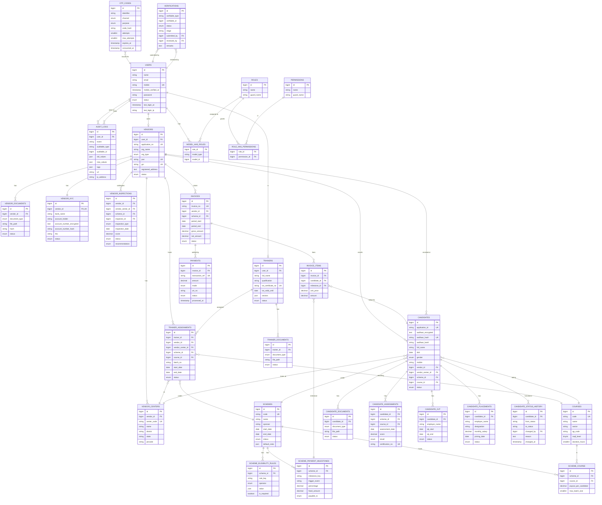

# EPR System — Entity Relationship Diagram

## Lifecycle status enums

| Model | States |
|-------|--------|
| `vendors.status` | `draft → submitted → pending_verification → inspection_scheduled → inspection_completed → approved → kyc_pending → active` (or `rejected`, `inactive`, `suspended`) |
| `vendor_centers.status` | `draft → pending_verification → active` (or `inactive`, `rejected`) |
| `trainers.status` | `draft → pending_verification → verified → active` (or `rejected`, `inactive`) |
| `candidates.status` | `registered → training → assessed → certified → placed` (or `dropout`) — enforced by `App\Services\CandidateLifecycle` |
| `verifications.status` | `pending → verified` / `rejected` / `info_required` — enforced by `HasVerificationStatus` trait |
| `invoices.status` | `draft → submitted → under_review → approved → paid` (or `rejected`) |
| `payments.status` | `pending → completed` / `failed` / `reversed` |
